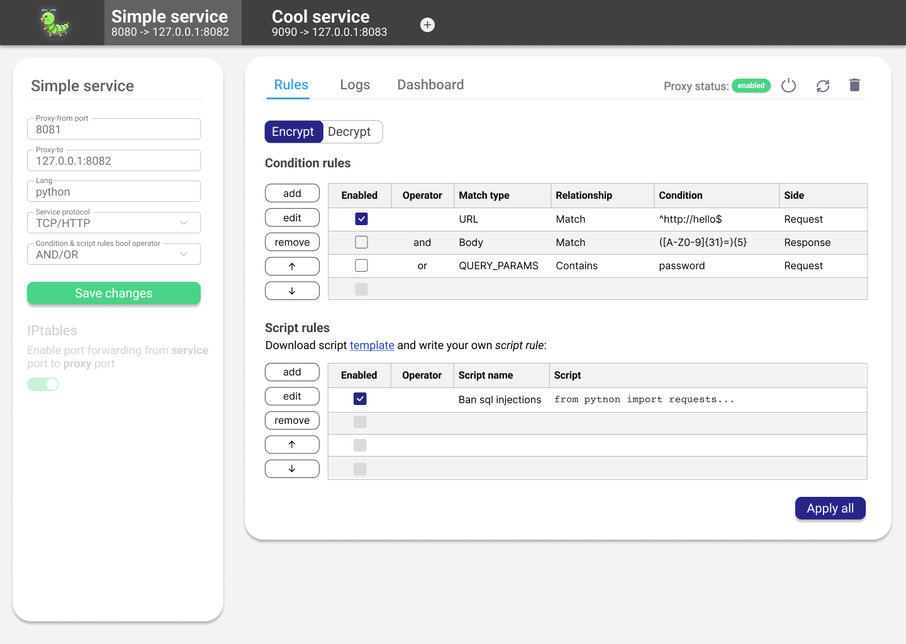
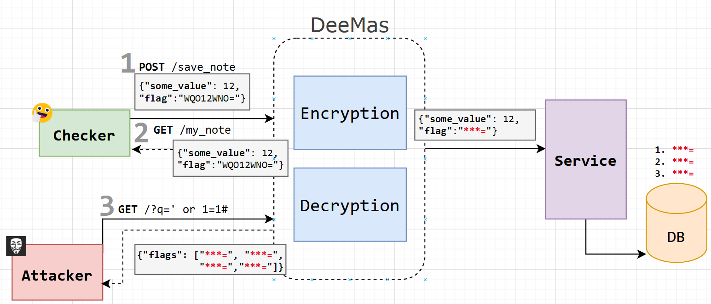

# 👩‍💻🚩 deemas - Сервис для (де)шифрования флажков

### ⚡ Powered by mitmproxy

Сервис написан на основе библиотеки [mitmproxy](https://mitmproxy.org/).

Mitmproxy поддерживает добавление собственных `аддонов`, которые могут перехватывать
`http` и `tcp` пакеты и выполнять над ними произвольную логику.

В DeeMas реализовано два аддона, для http и tcp. Они шифруют все входящие флаги и на основе пользовательских правил расшифровывают исходящие обратно.



### ⚖ Правила
Существует 2 типа правил: 
1. Conditions - правила основанные на заранее заданных условиях:
   -  type - например URL, Body, Header...
   -  relationship - Matches, Contains, Does not match
   -  condition - regex выражение
   -  side - request/response, client/server_connection
2. Scripts - правила в виде скриптов на python, написанные по определенному шаблону

Правила выполняются, если в сообщении ответа сервера есть флаги. Эти правила нужны для того, чтобы сделать вывод, нужно ли расшифровывать флаги клиенту? Если этим `клиентом` является `checker`, то ответ "да", а если вражеская команда, то, соответственно, "нет". Однако инфраструктура A&D построена так, что нельзя точно определить чей запрос к пришел. Чтобы приблизить ответ к истине, требуется провести анализ заголовков, тела сообщения, параметров и т.д. -
этим и занимается **Deemas**.



### 💨 Установка и запуск
```shell
$> ./install.sh
...
[+] Done!
$> ./start_server.sh
```
